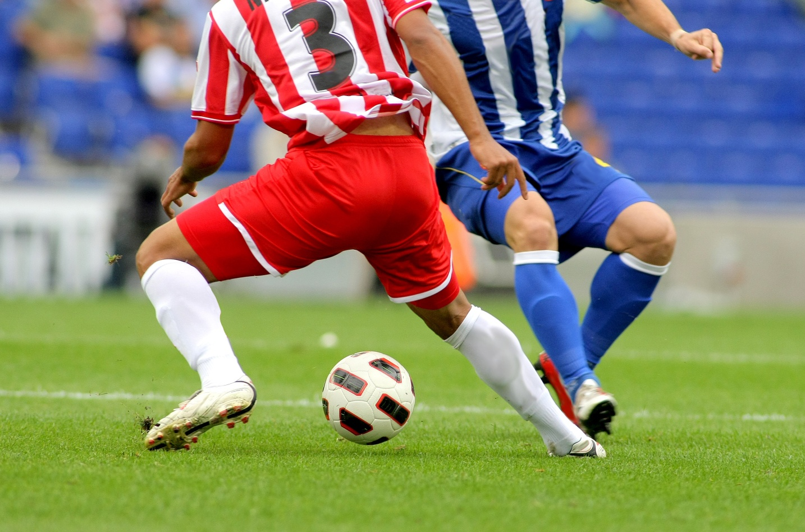
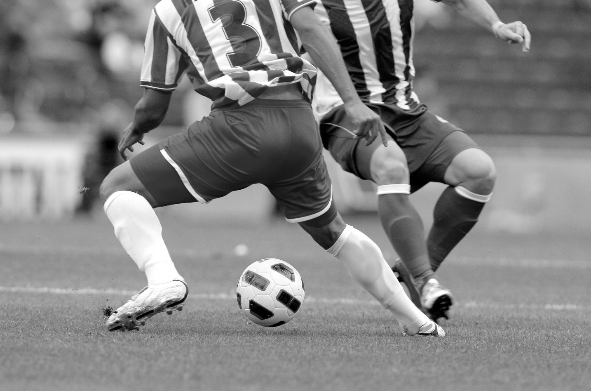

# 1. 이미지 불러오기 및 그레이스케일 변환

- OpenCV를 사용하여 이미지를 불러오고 화면에 출력
- 원본 이미지와 그레이스케일로 변환된 이미지를 나란히 표시

### 그레이스케일 개념

컬러 이미지는 각 픽셀이 R, G, B 세 가지 색상 값으로 구성되어 있으며, 그레이스케일 변환은 이 값을 하나의 밝기 값으로 변환하는 과정이다.  
OpenCV는 Y = 0.299R + 0.587G + 0.114B 공식을 사용하여 RGB 값을 하나의 밝기(Gray) 값으로 계산한다.

### 전체 코드
```python
import cv2 as cv
import sys #cv와 sys import
import numpy as np   # 요구사항인 np.hstack 사용하려면 필요

img = cv.imread('soccer.jpg') #cv.imread()를 사용하여 이미지 로드

if img is None : 
    sys.exit('파일이 존재하지 않습니다.') #img파일이 없다면 종료

#그레이스케일 변환
gray = cv.cvtColor(img,cv.COLOR_BGR2GRAY) #cv.cvtColor() 함수를 사용해 이미지를 그레이스케일로 변환
cv.imwrite('soccer_gray.jpg',gray) #변환 영상을 파일에 저장

gray_soccer = cv.cvtColor(gray, cv.COLOR_GRAY2BGR) #흑백픽셀을 컬러 형식으로 변환

hstack = np.hstack((img, gray_soccer)) #두 사진 가로로 연결

cv.namedWindow('Result', cv.WINDOW_NORMAL) # 창 크기 조절 가능하게 설정
cv.imshow('Result', hstack) #연결된 사진 출력
cv.waitKey(0) #입력이 들어올 때까지 기다림
cv.destroyAllWindows() #Open cv가 만든 창을 완전히 닫음
```

## 1) cv.imread()를 사용하여 이미지 로드

```python
img = cv.imread('soccer.jpg')
```

## 2) cv.cvtColor() 함수를 사용해 이미지를 그레이스케일로 변환

``` python
gray = cv.cvtColor(img,cv.COLOR_BGR2GRAY)
```
원본 이미지


변환 결과 



## 3) np.hstack 함수를 이용해 원본 이미지와 그레이스케일 이미지를 가로로 연결하여 출력

```python
hstack = np.hstack((img, gray_soccer)) #두 사진 가로로 연결
```

## 4) cv.imshow()와 cv.waitKey()를 사용해 결과를 화면에 표시하고, 아무 키나 누르면 창이 닫히도록 할 것

```python
cv.imshow('Result', hstack) #연결된 사진 출력
cv.waitKey(0) #입력이 들어올 때까지 기다림
cv.destroyAllWindows() #Open cv가 만든 창을 완전히 닫음
```

### 실행 결과 


# 2. 페인팅 붓 크기 조절 기능 추가
- 마우스 입력으로 이미지 위에 붓질
- 키보드 입력을 이용해 붓의 크기를 조절하는 기능 추가

### 전체 코드
```python
import cv2 as cv
import sys

img = cv.imread('soccer.jpg')  # img 불러오기

if img is None:
    sys.exit('파일이 존재하지 않습니다.') #img 없을 시 종료

brush_size = 5  #초기 붓 크기 = 5로 설정

def draw(event, x, y, flags, param): #마우스 이벤트 함수 정의
    global img, brush_size #전역 변수 사용
 
    if event == cv.EVENT_MOUSEMOVE and (flags & cv.EVENT_FLAG_LBUTTON): #마우스 이동중이고 좌측버튼 누른 상태일 때
        cv.circle(img, (x, y), brush_size, (255, 0, 0), -1) #파란색 원 그림

    elif event == cv.EVENT_MOUSEMOVE and (flags & cv.EVENT_FLAG_RBUTTON): #마우스 이동중이고 우측버튼 누른 상태일 때
        cv.circle(img, (x, y), brush_size, (0, 0, 255), -1) #빨간색 원 그림


cv.namedWindow('Painting') #윈도우 이름 
### imshow()가 이미 창을 만드는데 왜 nameWimdow를 쓰는지.... -> setMouseCallback은 “이미 존재하는 창”에 연결 , 따라서 아직 창이 존재하지 않으면 연결 실패 가능성이 있음
cv.setMouseCallback('Painting', draw) #마우스 이벤트 처리

while True: #계속 반복
    cv.imshow('Painting', img) #painting 창 만들기

    key = cv.waitKey(1) & 0xFF   #키 입력 받기
    if key == ord('+'): # + 입력받을 시
        brush_size += 1 #원 크기 +1
        if brush_size > 15: #크기가  15 초과라면
            brush_size = 15 #크기 15로 저장

    elif key == ord('-'): #-입력받으면
        brush_size -= 1 #원 크기 -1
        if brush_size < 1: #크기 1보다 작아지면
            brush_size = 1 #크기 1로 저장

    elif key == ord('q'): # q 입력시 종료
        break


cv.destroyAllWindows() #Open cv가 만든 창을 완전히 닫음
```

## 1) 초기 붓 크기는 5를 사용

```python
brush_size = 5  #초기 붓 크기 = 5로 설정
```

## 2) +입력 시 붓 크기 1 층가, - 입력 시 붓 크기 1 감소 (붓 크기는 최소 1, 최대 15로 제한)

```python
    key = cv.waitKey(1) & 0xFF   #키 입력 받기
    if key == ord('+'): # + 입력받을 시
        brush_size += 1 #원 크기 +1
        if brush_size > 15: #크기가  15 초과라면
            brush_size = 15 #크기 15로 저장

    elif key == ord('-'): #-입력받으면
        brush_size -= 1 #원 크기 -1
        if brush_size < 1: #크기 1보다 작아지면
            brush_size = 1 #크기 1로 저장
```

## 3) 좌클릭=파란색, 우클릭= 빨간색, 드래그로 연속 그리기 

```python
def draw(event, x, y, flags, param): #마우스 이벤트 함수 정의
    global img, brush_size #전역 변수 사용
 
    if event == cv.EVENT_MOUSEMOVE and (flags & cv.EVENT_FLAG_LBUTTON): #마우스가 이동중이고 좌측버튼 누른 상태일 때
        cv.circle(img, (x, y), brush_size, (255, 0, 0), -1) #파란색 원을 그림

    elif event == cv.EVENT_MOUSEMOVE and (flags & cv.EVENT_FLAG_RBUTTON): #마우스가 이동중이고 우측버튼 누른 상태일 때
        cv.circle(img, (x, y), brush_size, (0, 0, 255), -1) #빨간색 원을 그림
```

## 4) q 키를 누르면 영상 창이 종료

```python
    elif key == ord('q'): # q 입력시 종료
        break
```

### 실행 결과


# 3. 마우스로 영역 선택 및 ROI 추출

- 이미지를 불러오고 사용자가 마우스로 클릭하고 드래그하여 관심 영역(roi)를 선택
- 선택한 영역만 따로 저장하거나 표시

### 전체 코드

```python
import cv2 as cv
import sys

img = cv.imread('girl_laughing.jpg') #img 로드

if img is None : 
    sys.exit('파일이 존재하지 않습니다.') #img파일이 없다면 종료

imgs = img.copy() #원본용 이미지 저장해두기

ix, iy = None, None #시작 좌표 
drawing = False #드래그 중 여부
roi = None #선택된 영역

def draw(event,x,y,flags,param):#마우스 이벤트 함수
    global ix,iy,drawing,img,roi #전역변수

    if event == cv.EVENT_LBUTTONDOWN: #마우스 왼쪽 버튼 클릭했을 떄 초기 위치 저장
        drawing = True #드래그 상태 
        ix,iy = x,y #현재 위치를 시작 좌표로 저장
    
    elif event == cv.EVENT_MOUSEMOVE: #드래그 중이면 사각형 표시
        if drawing:
            img = imgs.copy() #계속 새로 그림
            cv.rectangle(img,(ix,iy),(x,y),(0,0,255),2) #사각형 그림
    
    elif event == cv.EVENT_LBUTTONUP: #마우스 떼면 ROI 선택된것 별도의 창에 출력
        drawing = False
        img = imgs.copy() #계속 새로 그림
        cv.rectangle(img,(ix,iy),(x,y),(0,0,255),2) #사각형 그리기

        #numpy 슬라이싱으로 roi 추출
        x1,x2 = min(ix,x), max(ix,x)
        y1,y2 = min(iy,y), max(iy,y)

        roi = imgs[y1:y2, x1:x2] #numpy 슬라이싱을 사용하여 roi 저장

        if roi.size !=0:
            cv.imshow('ROI',roi) #roi가 존재하면 (0이아니면) ROI창 띄움

    cv.imshow('Drawing',img)

cv.namedWindow('Drawing') #윈도우 이름 Drawing로 선언  
cv.setMouseCallback('Drawing', draw) #마우스 이벤트 처리

while True: #계속 반복
    cv.imshow('Drawing', img) #Drawing 창 만들기

    key = cv.waitKey(1) & 0xFF   #키 입력 받기

    if key == ord('r'): # r 입력받을 시 선택 리셋
        img = imgs.copy()
        cv.destroyWindow('ROI')  # ROI 창 닫기

    elif key == ord('s'): #s입력받으면 ROI img 저장
        if roi is not None:
            cv.imwrite('roi.jpg', roi) #ROI 저장
            print('ROI saved') #ROI 저장 완료 출력

    elif key == ord('q'): # q 입력시 종료
        break

cv.destroyAllWindows() #Open cv가 만든 창을 완전히 닫음
```


## 1) 이미지를 불러오고 화면에 출력

```python
img = cv.imread('girl_laughing.jpg') #img 로드

...
    cv.imshow('Drawing',img)

```

## 2) cv.setMouseCallback()을 사용하여 마우스 이벤트를 처리

```python
cv.setMouseCallback('Drawing', draw) #draw 함수에 대한 마우스 이벤트 처리
```

## 3) 사용자가 클릭한 시작점에서 드래그하여 사각형을 그리며 영역을 선택

```python
    if event == cv.EVENT_LBUTTONDOWN: #마우스 왼쪽 버튼 클릭했을 떄 초기 위치 저장
        drawing = True #드래그 상태 
        ix,iy = x,y #현재 위치를 시작 좌표로 저장
    
    elif event == cv.EVENT_MOUSEMOVE: #드래그 중이면 사각형 표시
        if drawing:
            img = imgs.copy() #계속 새로 그림(imgs는 img 리셋용으로 저장해둔 것)
            cv.rectangle(img,(ix,iy),(x,y),(0,0,255),2) #사각형 그림
```
출력 결과 


## 4) 마우스를 놓으면 해당 영역을 잘라내서 별도의 창에 출력

```python    
    elif event == cv.EVENT_LBUTTONUP: #마우스 떼면 ROI 선택된것 별도의 창에 출력
        drawing = False
        img = imgs.copy() #계속 새로 그림
        cv.rectangle(img,(ix,iy),(x,y),(0,0,255),2) #사각형 그리기

        #numpy 슬라이싱으로 roi 추출
        x1,x2 = min(ix,x), max(ix,x)
        y1,y2 = min(iy,y), max(iy,y)

        roi = imgs[y1:y2, x1:x2] #numpy 슬라이싱을 사용하여 roi 저장

        if roi.size !=0:
            cv.imshow('ROI',roi) #roi가 존재하면 (0이아니면) ROI창 띄움

    cv.imshow('Drawing',img)
```
출력 결과


## 5) r키를 누르면 영역 선택을 리셋하고 처음부터 다시 선택, s키를 누르면 선택한 영역을 이미지 파일로 저장

```python
    if key == ord('r'): # r 입력받을 시 선택 리셋
        img = imgs.copy()
        cv.destroyWindow('ROI')  # ROI 창 닫기

    elif key == ord('s'): #s입력받으면 ROI img 저장
        if roi is not None:
            cv.imwrite('roi.jpg', roi) #ROI 저장
            print('ROI saved') #ROI 저장 완료 출력
```


### 출력 결과


