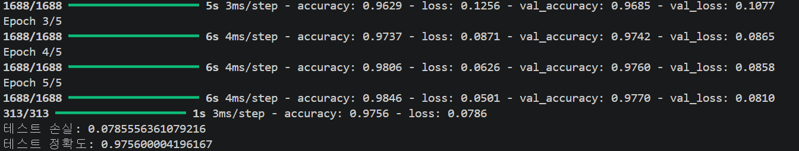
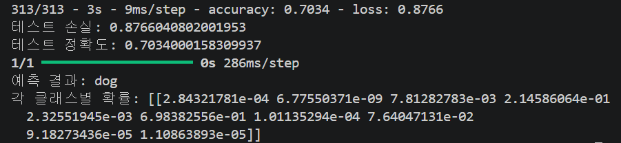

# 1. 간단한 이미지 분류기 구현

- 손글씨 숫자 이미지(MNIST 데이터셋)를 이용하여 간단한 이미지 분류기를 구

### 전체 코드
```python
import tensorflow as tf
from tensorflow.keras.datasets import mnist
from tensorflow.keras.models import Sequential
from tensorflow.keras.layers import Flatten, Dense
from tensorflow.keras.utils import to_categorical


(x_train, y_train), (x_test, y_test) = mnist.load_data() # MNIST 데이터셋을 로드

# 데이터를 훈련 세트와 테스트 세트로 분할
print("훈련 이미지 shape:", x_train.shape)   # (60000, 28, 28) # 훈련 세트
print("테스트 이미지 shape:", x_test.shape)   # (10000, 28, 28) # 데이터 세트

# 데이터 전처리 
x_train = x_train / 255.0 # 픽셀값을 0~255 -> 0~1로 정규화
x_test = x_test / 255.0 

y_train = to_categorical(y_train, 10) # One-Hot 인코딩
y_test = to_categorical(y_test, 10)

#간단한 신경망 모델을 구축
model = Sequential([             # Sequential 모델 활용
    Flatten(input_shape=(28, 28)),   # 28x28 이미지를 1차원으로 펼침
    Dense(128, activation='relu'),   # Dense 레이어를 활용 / 은닉층
    Dense(10, activation='softmax')  # 출력층: 숫자 0~9 총 10개
])

# 모델 컴파일
model.compile(
    optimizer='adam',
    loss='categorical_crossentropy',
    metrics=['accuracy']
)

# 모델 학습
model.fit(
    x_train, y_train,
    epochs=5,
    batch_size=32,
    validation_split=0.1
)

# 모델 평가
test_loss, test_acc = model.evaluate(x_test, y_test)

print("테스트 손실:", test_loss)
print("테스트 정확도:", test_acc)
```

## 1) MNIST 데이터셋을 로드

```python
(x_train, y_train), (x_test, y_test) = mnist.load_data() # MNIST 데이터셋을 로드
```

## 2) 데이터를 훈련 세트와 테스트 세트로 분할

``` python
print("훈련 이미지 shape:", x_train.shape)   # (60000, 28, 28) # 훈련 세트
print("테스트 이미지 shape:", x_test.shape)   # (10000, 28, 28) # 데이터 세트                     
```

## 3) 간단한 신경망 모델을 구축

- Sequential 모델과 Dense 레이어 활용
```python
model = Sequential([             # Sequential 모델 활용
    Flatten(input_shape=(28, 28)),   # 28x28 이미지를 1차원으로 펼침
    Dense(128, activation='relu'),   # Dense 레이어를 활용 / 은닉층
    Dense(10, activation='softmax')  # 출력층: 숫자 0~9 총 10개
])
```

## 4) 모델을 훈련시키고 정확도를 평가

```python
# 모델 컴파일
model.compile(
    optimizer='adam',
    loss='categorical_crossentropy',
    metrics=['accuracy']
)

# 모델 학습
model.fit(
    x_train, y_train,
    epochs=5,
    batch_size=32,
    validation_split=0.1
)

# 모델 평가
test_loss, test_acc = model.evaluate(x_test, y_test)

print("테스트 손실:", test_loss)
print("테스트 정확도:", test_acc)
```

### 실행 결과




# 2. CIFAR-10 데이터셋을활용한 CNN 모델구축
- CIFAR-10 데이터셋을 활용하여 합성곱 신경망(CNN)을 구축하고, 이미지 분류를 수행

### 전체 코드
```python
import tensorflow as tf
from tensorflow.keras.datasets import cifar10
from tensorflow.keras.models import Sequential
from tensorflow.keras.layers import Conv2D, MaxPooling2D, Flatten, Dense
from tensorflow.keras.utils import load_img, img_to_array
import numpy as np

# CIFAR-10 데이터셋 로드
(x_train, y_train), (x_test, y_test) = cifar10.load_data()

# 데이터 전처리
# 입력 이미지의 픽셀값을 0~1 범위로 정규화
x_train = x_train / 255.0
x_test = x_test / 255.0

# CIFAR-10 클래스 이름 정의
class_names = [
    'airplane', 'automobile', 'bird', 'cat', 'deer',
    'dog', 'frog', 'horse', 'ship', 'truck'
]

# CNN 모델 구성
model = Sequential([
    Conv2D(32, (3, 3), activation='relu', input_shape=(32, 32, 3)),
    MaxPooling2D((2, 2)),

    Conv2D(64, (3, 3), activation='relu'),
    MaxPooling2D((2, 2)),

    Conv2D(64, (3, 3), activation='relu'),

    Flatten(),
    Dense(64, activation='relu'),
    Dense(10, activation='softmax')
])

# 모델 컴파일
# 다중 클래스 분류 문제이므로 sparse_categorical_crossentropy 사용
model.compile(
    optimizer='adam',
    loss='sparse_categorical_crossentropy',
    metrics=['accuracy']
)

# 모델 학습
model.fit(
    x_train,
    y_train,
    epochs=10,
    batch_size=64,
    validation_split=0.1
)

# 테스트 데이터셋을 이용한 성능 평가
test_loss, test_acc = model.evaluate(x_test, y_test, verbose=2)
print("테스트 손실:", test_loss)
print("테스트 정확도:", test_acc)

# 외부 이미지(dog.jpg) 예측
img = load_img("dog.jpg", target_size=(32, 32))
img_array = img_to_array(img)

# 학습 데이터와 동일한 방식으로 정규화 수행
img_array = img_array / 255.0

# 모델 입력 형태에 맞게 배치 차원 추가
img_array = np.expand_dims(img_array, axis=0)

# 예측 수행
prediction = model.predict(img_array)
predicted_class = np.argmax(prediction, axis=1)[0]

print("예측 결과:", class_names[predicted_class])
print("각 클래스별 확률:", prediction)
```

## 1) CIFAR-10 데이터셋을 로드
```python
(x_train, y_train), (x_test, y_test) = cifar10.load_data()
```
## 2) 데이터 전처리(정규화 등)를 수행
```python
# 입력 이미지의 픽셀값을 0~1 범위로 정규화
x_train = x_train / 255.0
x_test = x_test / 255.0

# CIFAR-10 클래스 이름 정의
class_names = [
    'airplane', 'automobile', 'bird', 'cat', 'deer',
    'dog', 'frog', 'horse', 'ship', 'truck'
]
```
## 3) CNN 모델을 설계하고 훈련
```python
#모델 설계 -> Cov2D, MaxPooling2D, Flatten, Dense 레이어를 활용하여 CNN 구성
model = Sequential([
    Conv2D(32, (3, 3), activation='relu', input_shape=(32, 32, 3)),
    MaxPooling2D((2, 2)),

    Conv2D(64, (3, 3), activation='relu'),
    MaxPooling2D((2, 2)),

    Conv2D(64, (3, 3), activation='relu'),

    Flatten(),
    Dense(64, activation='relu'),
    Dense(10, activation='softmax')
])
# 모델 컴파일
# 다중 클래스 분류 문제이므로 sparse_categorical_crossentropy 사용
model.compile(
    optimizer='adam',
    loss='sparse_categorical_crossentropy',
    metrics=['accuracy']
)

# 모델 학습
model.fit(
    x_train,
    y_train,
    epochs=10,
    batch_size=64,
    validation_split=0.1
)

```
## 4) 모델의 성능을 평가하고, 테스트 이미지(dog.jpg)에 대한 예측을 수행
```python
# 테스트 데이터셋을 이용한 성능 평가
test_loss, test_acc = model.evaluate(x_test, y_test, verbose=2)
print("테스트 손실:", test_loss)
print("테스트 정확도:", test_acc)

# 외부 이미지(dog.jpg) 예측
img = load_img("dog.jpg", target_size=(32, 32))
img_array = img_to_array(img)

# 학습 데이터와 동일한 방식으로 정규화 수행
img_array = img_array / 255.0

# 모델 입력 형태에 맞게 배치 차원 추가
img_array = np.expand_dims(img_array, axis=0)

# 예측 수행
prediction = model.predict(img_array)
predicted_class = np.argmax(prediction, axis=1)[0]

print("예측 결과:", class_names[predicted_class])
print("각 클래스별 확률:", prediction)
```

## 실행 결과


