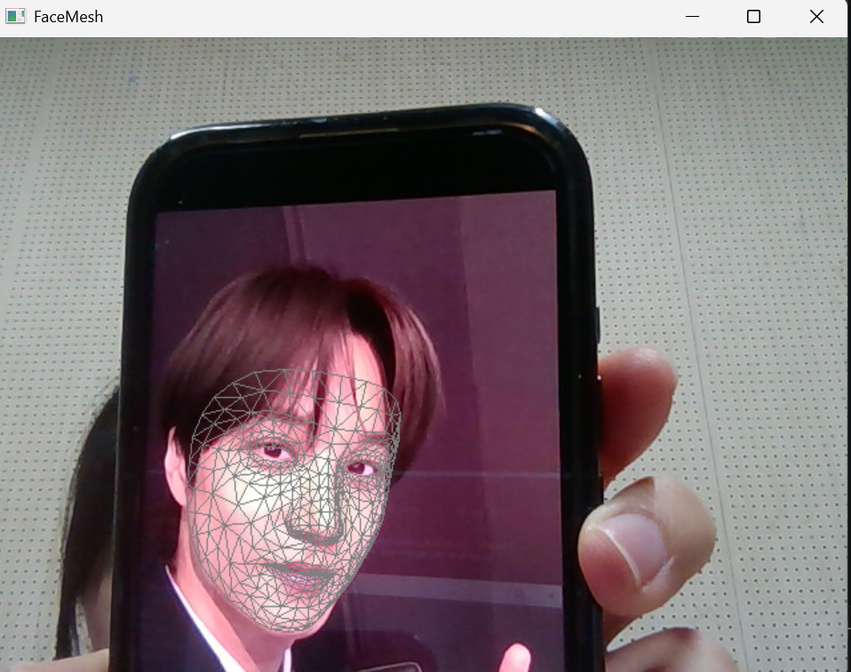

# 1. SORT 알고리즘을 활용한 다중 객체 추적기 구현

- 이 실습에서는 SORT 알고리즘을 사용하여 비디오에서 다중 객체를 실시간으로 추적하는 프로그램을 구현합니다. 이를 통해 객체 추적의 기본 개념과 SORT 알고리즘의 적용 방법을 학습할 수 있습니다.

## 1) 객체 검출기 구현: YOLOv3와 같은 사전 훈련된 객체 검출 모델을 사용하여 각 프레임에서 객체를 검출합니다.
```python
# 5. YOLO로 객체 검출하는 함수
#    현재 프레임에서 차량 객체를 찾아서
#    bounding box 리스트를 반환
def detect_objects(frame, net, output_layers):
    height, width = frame.shape[:2]

    # 이미지를 YOLO 입력 형태로 변환
    blob = cv2.dnn.blobFromImage(
        frame,
        scalefactor=1/255.0,
        size=(608, 608),
        swapRB=True,
        crop=False
    )

    net.setInput(blob)
    outputs = net.forward(output_layers)

    boxes = []
    confidences = []
    class_ids = []

    # YOLO 출력 해석
    for output in outputs:
        for detection in output:
            scores = detection[5:]
            class_id = np.argmax(scores)
            confidence = scores[class_id]

            # confidence가 낮으면 무시
            if confidence < conf_threshold:
                continue

            label = class_names[class_id]

            # 차량 관련 클래스만 사용
            if label not in target_classes:
                continue

            center_x = int(detection[0] * width)
            center_y = int(detection[1] * height)
            w = int(detection[2] * width)
            h = int(detection[3] * height)

            # center 형식을 x1,y1,x2,y2 형태로 바꾸기 위해
            x = int(center_x - w / 2)
            y = int(center_y - h / 2)

            boxes.append([x, y, w, h])
            confidences.append(float(confidence))
            class_ids.append(class_id)

    # NMS 적용해서 겹치는 박스 줄이기
    indices = cv2.dnn.NMSBoxes(boxes, confidences, conf_threshold, nms_threshold)

    result_boxes = []

    if len(indices) > 0:
        for i in indices.flatten():
            x, y, w, h = boxes[i]

            x1 = max(0, x)
            y1 = max(0, y)
            x2 = max(0, x + w)
            y2 = max(0, y + h)

            result_boxes.append([x1, y1, x2, y2])

    return result_boxes

```
## 2) mathworks.comSORT 추적기 초기화: 검출된 객체의 경계 상자를 입력으로 받아 SORT 추적기를 초기화합니다.
```python
new_track = Track(detections[det_idx])
tracks.append(new_track)
```
## 3) 객체 추적: 각 프레임마다 검출된 객체와 기존 추적 객체를 연관시켜 추적을 유지합니다.
```python

```
## 4) 결과 시각화: 추적된 각 객체에 고유 ID를 부여하고, 해당 ID와 경계 상자를 비디오 프레임에 표시하여 실시간으로출력합니다.
```python

```

## 실행 결과


# 1. Mediapipe를 활용한 얼굴 랜드마크 추출 및 시각화

- Mediapipe의 FaceMesh 모듈을 사용하여 얼굴의 468개 랜드마크를 추출하고, 이를 실시간 영상에 시각화하는프로그램을 구현합니다.

## 전체 코드 
```python
import cv2
import mediapipe as mp

mp_face_mesh = mp.solutions.face_mesh # MediaPipe 안의 face mesh 기능을 사용하기 위한 모듈
mp_drawing = mp.solutions.drawing_utils # 랜드마크를 화면에 그리기 위함
mp_drawing_styles = mp.solutions.drawing_styles # MediaPipe에서 제공하는 기본 drawing 스타일 사용을 위함

# FaceMesh 객체를 생성함
face_mesh = mp_face_mesh.FaceMesh(
    static_image_mode=False,
    max_num_faces=1,  # 한 번에 최대 1명의 얼굴만 검출하도록 설정
    refine_landmarks=False,
    min_detection_confidence=0.5, # 얼굴 검출 최소 신뢰도 설정
    min_tracking_confidence=0.5  # 얼굴 추적 최소 신뢰도 설정
)

# 기본 웹캠(0번 카메라)을 열기
cap = cv2.VideoCapture(0)

# 웹캠이 안 열리면 오류 메시지 출력
if not cap.isOpened():
    print("웹캠을 열 수 없습니다.")
    exit()

# 무한 반복하면서 웹캠 프레임을 계속 받아옴
while True:
    # 웹캠에서 프레임 하나를 읽어옴
    ret, frame = cap.read()

    # 프레임을 읽지 못했으면 반복 종료
    if not ret:
        break

    frame = cv2.flip(frame, 1) # 화면을 좌우 반전
    rgb_frame = cv2.cvtColor(frame, cv2.COLOR_BGR2RGB)

    results = face_mesh.process(rgb_frame)  # 변환한 프레임을 FaceMesh에 넣어서 얼굴 랜드마크 검출 수행

    # 얼굴 랜드마크가 검출되었는지 확인
    if results.multi_face_landmarks:
        # 검출된 얼굴들에 대해 반복
        for face_landmarks in results.multi_face_landmarks:
            # 검출된 랜드마크와 연결선을 화면에 그림
            mp_drawing.draw_landmarks(
                image=frame, # 원본 프레임 위에 그림
                landmark_list=face_landmarks, # 검출된 얼굴 랜드마크 정보
                connections=mp_face_mesh.FACEMESH_TESSELATION, # 얼굴의 삼각형 형태 연결 구조를 사용
                landmark_drawing_spec=None,
                connection_drawing_spec=mp_drawing_styles.get_default_face_mesh_tesselation_style()
            )

    cv2.imshow("FaceMesh", frame)     # 결과가 그려진 프레임을 화면에 출력

    if cv2.waitKey(1) == 27:
        break # ESC 키 누르면 종료

cap.release() # 반복문이 끝나면 웹캠 장치 해제
cv2.destroyAllWindows() # 모든 OpenCV 창 닫기
```

## 1) Mediapipe의 FaceMesh 모듈을 사용하여 얼굴 랜드마크 검출기를 초기화합니다.
```python
mp_face_mesh = mp.solutions.face_mesh # MediaPipe 안의 face mesh 기능을 사용하기 위한 모듈
mp_drawing = mp.solutions.drawing_utils # 랜드마크를 화면에 그리기 위함
mp_drawing_styles = mp.solutions.drawing_styles # MediaPipe에서 제공하는 기본 drawing 스타일 사용을 위함

# FaceMesh 객체를 생성함
face_mesh = mp_face_mesh.FaceMesh(
    static_image_mode=False,
    max_num_faces=1,  # 한 번에 최대 1명의 얼굴만 검출하도록 설정
    refine_landmarks=False,
    min_detection_confidence=0.5, # 얼굴 검출 최소 신뢰도 설정
    min_tracking_confidence=0.5  # 얼굴 추적 최소 신뢰도 설정
)
```
## 2) OpenCV를 사용하여 웹캠으로부터 실시간 영상을 캡처합니다.
```python
# 기본 웹캠(0번 카메라)을 열기
cap = cv2.VideoCapture(0)

# 웹캠이 안 열리면 오류 메시지 출력
if not cap.isOpened():
    print("웹캠을 열 수 없습니다.")
    exit()

# 무한 반복하면서 웹캠 프레임을 계속 받아옴
while True:
    # 웹캠에서 프레임 하나를 읽어옴
    ret, frame = cap.read()

    # 프레임을 읽지 못했으면 반복 종료
    if not ret:
        break
```
## 3) 검출된 얼굴 랜드마크를 실시간 영상에 점으로 표시합니다.
```python
   # 얼굴 랜드마크가 검출되었는지 확인
    if results.multi_face_landmarks:
        # 검출된 얼굴들에 대해 반복
        for face_landmarks in results.multi_face_landmarks:
            # 검출된 랜드마크와 연결선을 화면에 그림
            mp_drawing.draw_landmarks(
                image=frame, # 원본 프레임 위에 그림
                landmark_list=face_landmarks, # 검출된 얼굴 랜드마크 정보
                connections=mp_face_mesh.FACEMESH_TESSELATION, # 얼굴의 삼각형 형태 연결 구조를 사용
                landmark_drawing_spec=None,
                connection_drawing_spec=mp_drawing_styles.get_default_face_mesh_tesselation_style()
            )
    cv2.imshow("FaceMesh", frame)     # 결과가 그려진 프레임을 화면에 출력
```
## 4) ESC 키를 누르면 프로그램이 종료되도록 설정합니다
```python
    if cv2.waitKey(1) == 27:
        break # ESC 키 누르면 종료

```
## 실행 결과
[!실행 결과][result_2]


